# Examen Systèmes Distribués

## Eureka discovery service
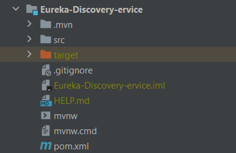

## gateway service
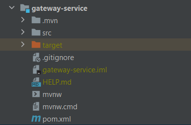

## radar service
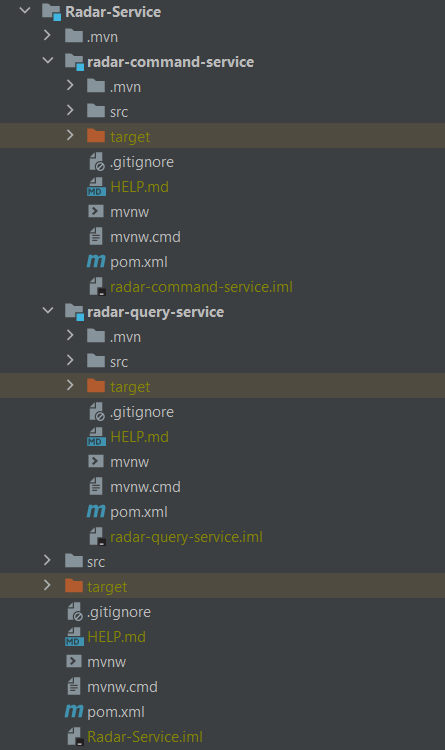

## immatricualtion service
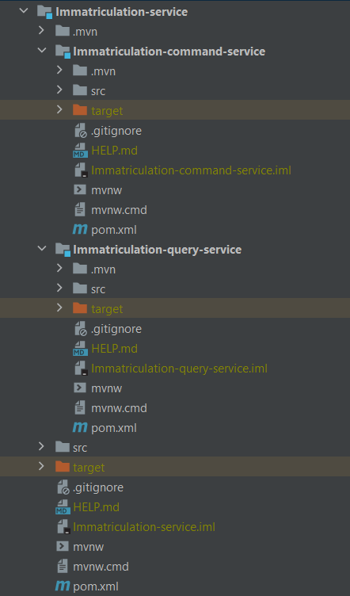

## infraction service
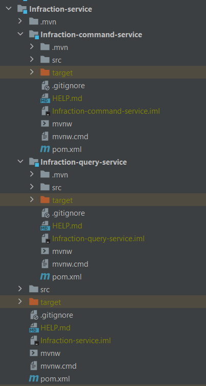

## Testing Apis
### add radar 
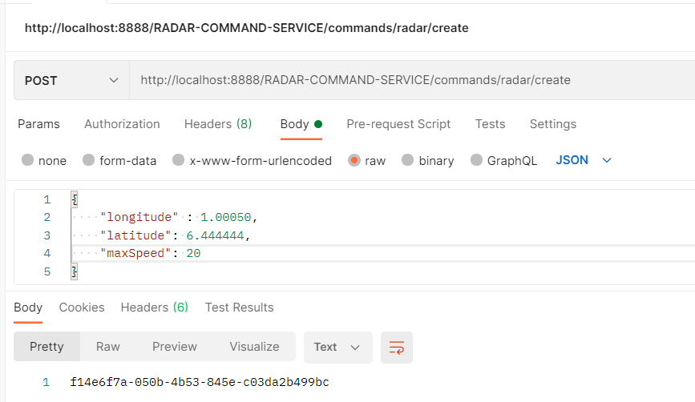
### get all radars
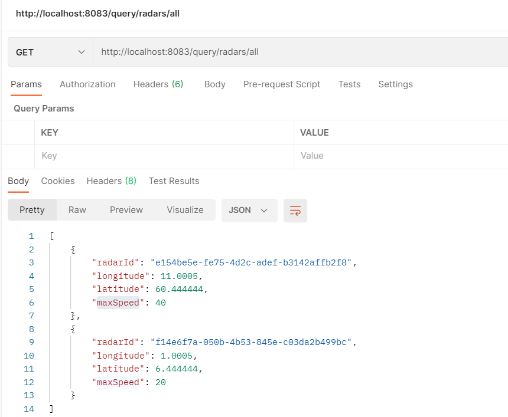
### create vehicle
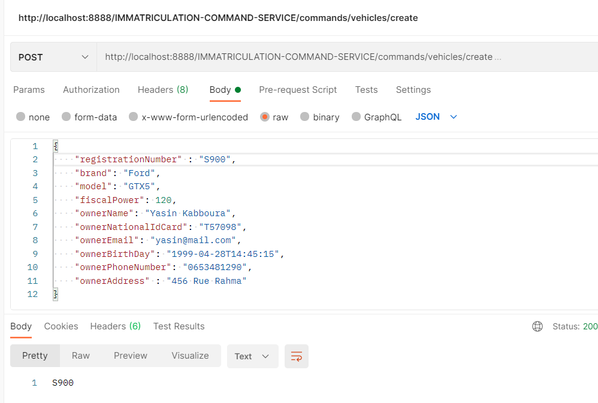
### list all vehicles
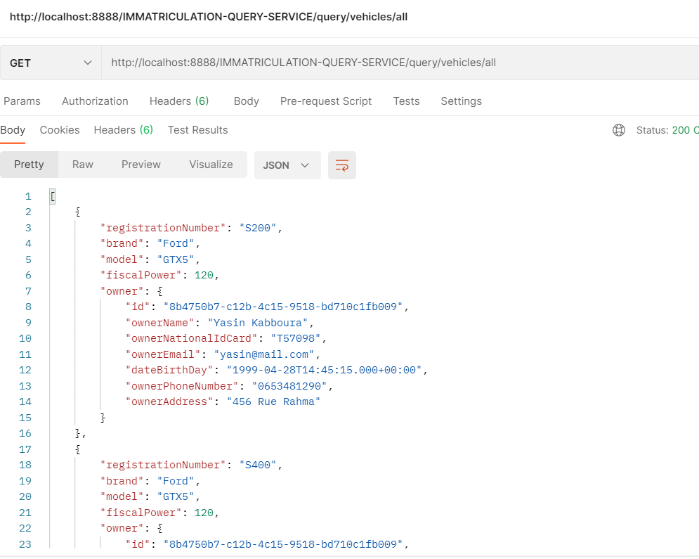
### over speed violation
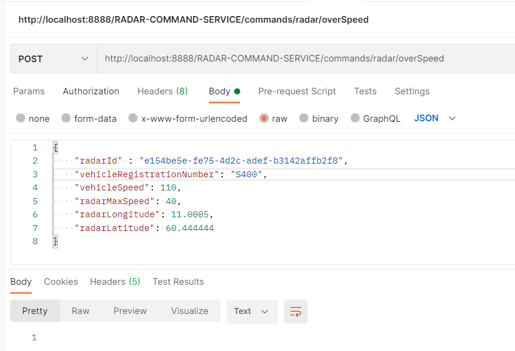
### violation list
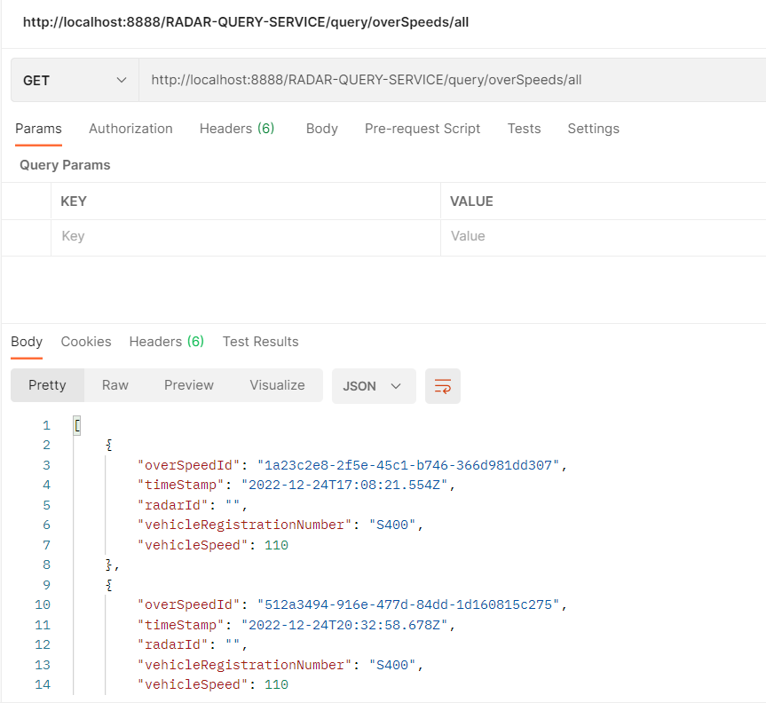
### infractions list
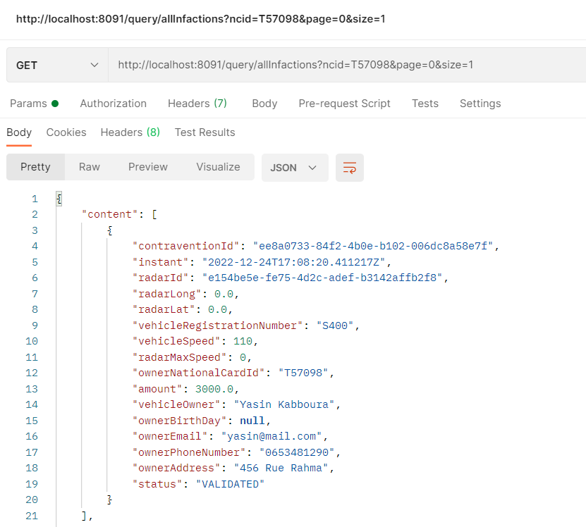

