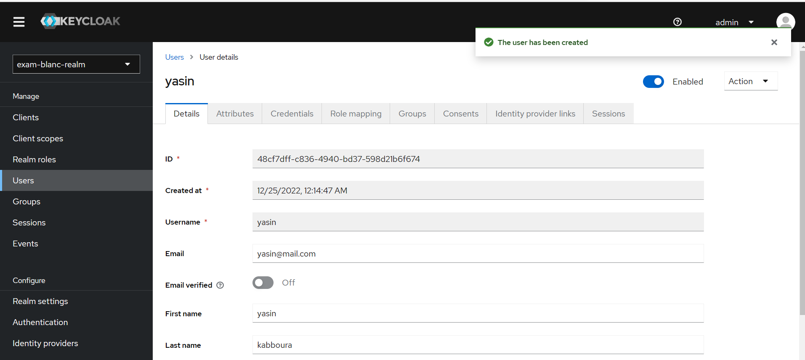

# Examen Systèmes Distribués

## Eureka discovery service

## gateway service

## radar service

## immatricualtion service

## infraction service

## Testing Apis
### add radar 

### get all radars

### create vehicle

### list all vehicles

### over speed violation

### violation list

### infractions list

## Front With Angular Test
### radars list

### vehicles list

### vehicle owner

### search infractions 

### infractions wrong National Card Number

###  infractions list

## Security with keycloack Test
### creating exam-blanc -realm

### creating exam client

### creating users

### creating roles ADMIN USER

### givving the user roles

### services configuration

### test 

#### generating jwt

#### retesting

